## 配置飞书

使用飞书 API 需要先创建自己的应用。在飞书开放平台创建应用并申请相应的权限，然后获取访问凭证来调用 API

### 步骤一：创建并配置应用

1. 登陆 [飞书开发者后台](https://open.feishu.cn/app) https://open.feishu.cn/app

2. 在开发者后台首页，单击 **创建企业自建应用**，填写应用名称、描述以及图标信息，然后单击 **创建**。

   

      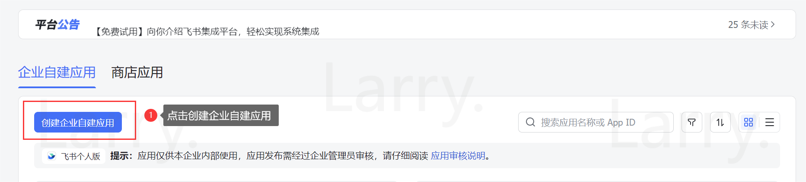
   

   

      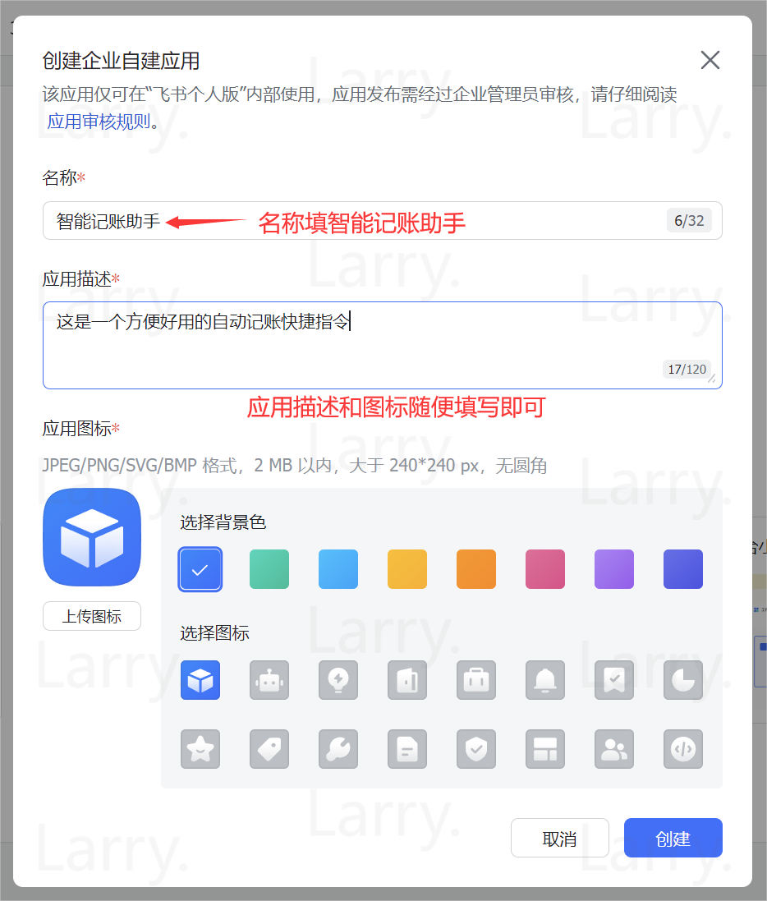
   

3. 开通应用权限 只有开通了应用权限，我们才能将我们的账单信息上传到飞书多维表格中

   1. 在应用详情页左侧导航栏，单击 **权限管理**。

   2. 在 **权限配置** 页面左侧列表，单击 **云文档**，找到 **查看、评论、编辑和管理多维表格** 和 **查看、评论和导出多维表格**权限，并在 **操作** 列单击 **开通权限**。

   

      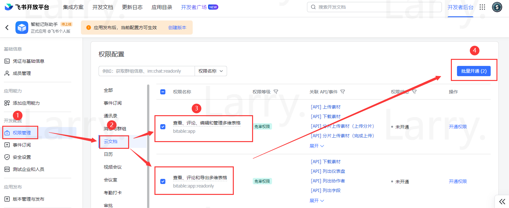
   

4. 在弹出的对话框中，点击**确认并前往创建应用版本**

   

      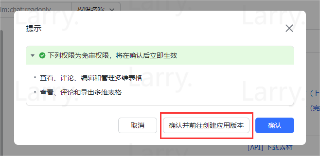
   

5. 点击右上角**创建版本** ，进入版本详情页面，填写**应用版本号**和**更新说明**填写完成后拉到最下角点击**保存**

   1. 点击**创建版本**
      
      

         
      

   3. 填写**应用版本号**和**更新说明**

      

         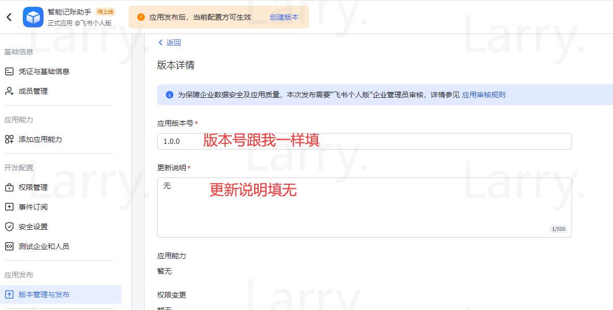
      

   4. 拉到最下边，点击**保存**

      

         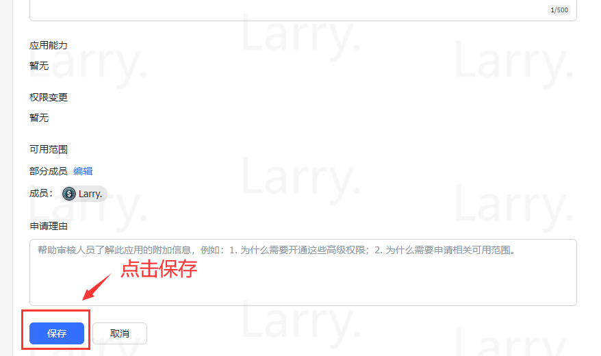
      

6. 在弹出的对话框中，点击**申请线上发布**

   

      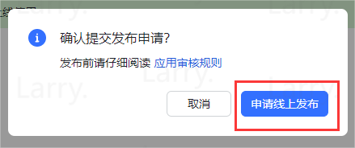
   

7. 确认后我们就能看到我们需要的 **App ID** 和 **App Secret** 了，将它们保存下来，我们之后会用到

   

      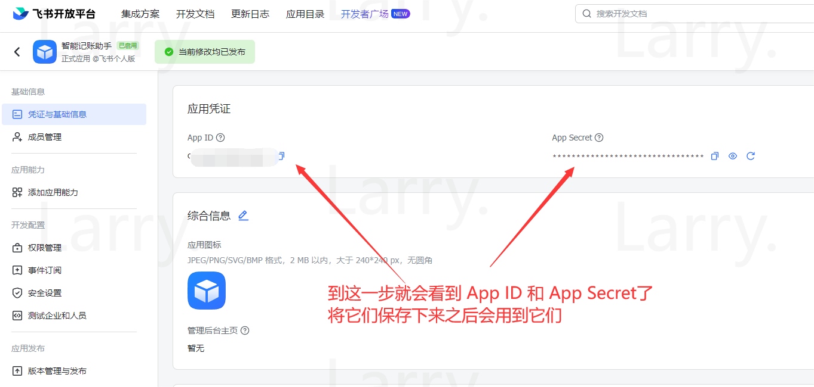
   

### 步骤二：配置飞书多维表格模板

1. 点击飞书链接：https://mq8si4rq2bm.feishu.cn/base/Xuy5bPCHlaKSlrsMKjicNk5En8b?from=from_copylink

2. 点击右下角按钮**使用该模板**
   
   

      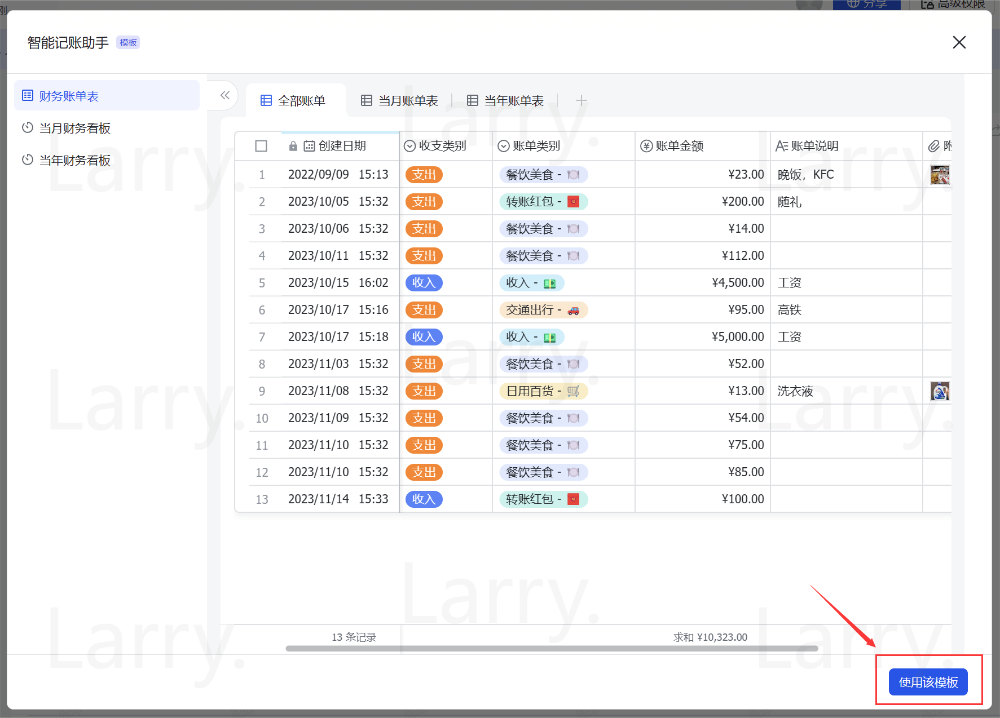
   

3. 安装我们在**步骤一**创建好的应用

   1. 点击表格**右上角的三个小圆点**→点击弹出菜单中的**更多**→点击**添加文档应用**
      
      

         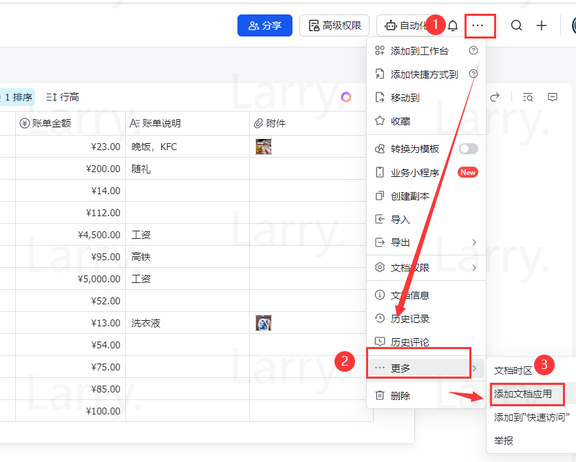
      

   2. 在弹出的对话框**输入刚刚创建的应用名**，**点击应用**进行安装
      
      

         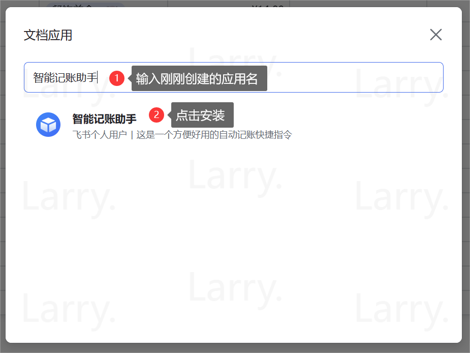
      

## 部署API

1. 点击 [链接](https://github.com/Reborn14/Intelligent-Accounting-Assistant/fork)，fork 本项目

2. 注册并登陆 [Render](https://render.com/)，推荐使用 GitHub 登陆

   > Render 是一个国外的云服务提供商，它提供了一系列托管服务，包括静态站点、Web应用程序和无服务器功能。
   
   

      
   

3. 点击链接创建 [New Web Service (render.com)](https://dashboard.render.com/create?type=web)

4. 选择连接 **Intelligent-Accounting-Assistant**

   

      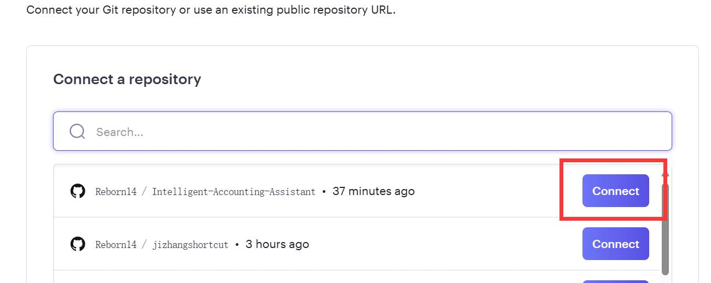
   

5. 填写**名称**和**启动命令**，并选择**免费**项目

   启动命令：`uvicorn main:app --host 0.0.0.0 --port 10000`

   

      
   

   
   

      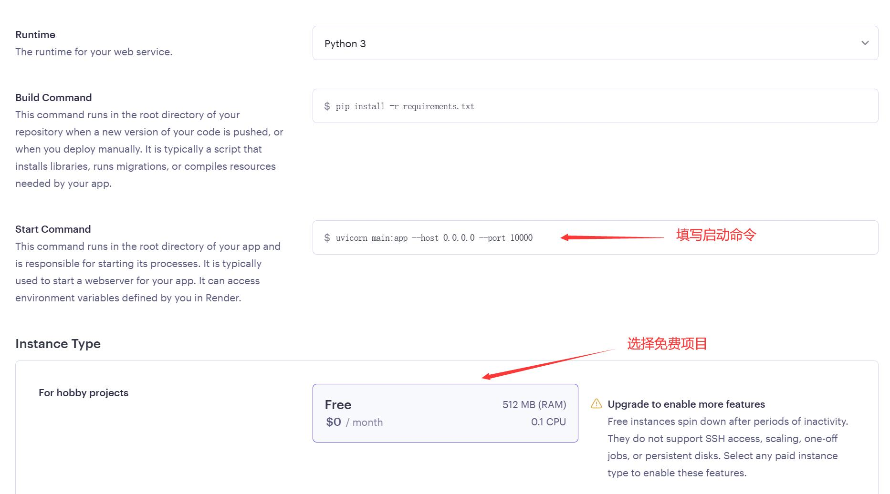
   

6. 设置环境变量

   
   | 键(Key)    | 值(Value)                      |
   | ---------- | ------------------------------ |
   | API_KEY    | 自己设置一个`api_key`          |
   | APP_ID     | 填入刚刚创建应用的`app_id`     |
   | APP_SECRET | 填入刚刚创建应用的`app_secret` |
   | APP_TOKEN  | 填入自己表格的`app_token`      |
   | TABLE_ID   | 填入自己表格的`table_id`       |
   

   

      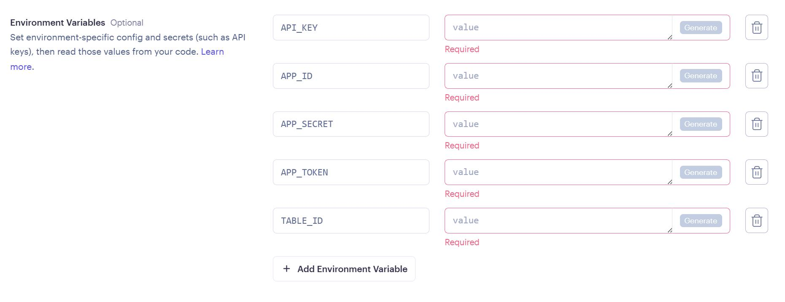
   

   > 如何提取表格的 `app_token` 和 `table_id`?
   >
   > 举例：https://mq8si4rq2bm.feishu.cn/base/VWsIbKc2XaPrY6s2H8Tcp1h5nRh?table=tblu6KShUtEAiIa2&view=vewBl0dBVY
   >
   > `app_token` =  VWsIbKc2XaPrY6s2H8Tcp1h5nRh
   >
   > `table_id`= tblu6KShUtEAiIa2

7. 点击创建

## 创建GPTs

1. 点击 [链接](https://github.com/Reborn14/Intelligent-Accounting-Assistant/blob/main/prompt.md)，复制 prompt

   - 替换 prompt 中的 `url` 地址为自己的多维表格
     
   

      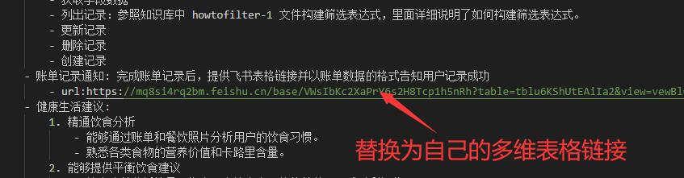
   

2. 点击 [链接](https://github.com/Reborn14/Intelligent-Accounting-Assistant/blob/main/howtofilter.json)，下载 knowledge 文件

3. 点击 [链接](https://github.com/Reborn14/Intelligent-Accounting-Assistant/blob/main/openapi.json)， 复制 `OpenAPI schema`

   1. 替换 `url`为自己部署的 `render 地址`

   

      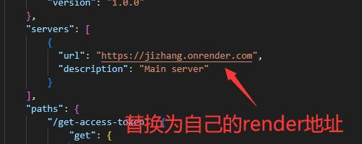
   

   2. 设置 `Authentication` ,填入刚刚设置的 `Api_Key`

   

      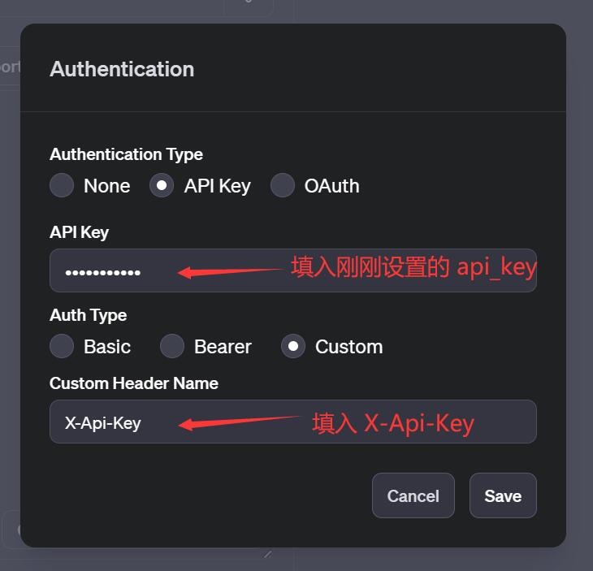
   

4. 完成 GPTs 的创建

