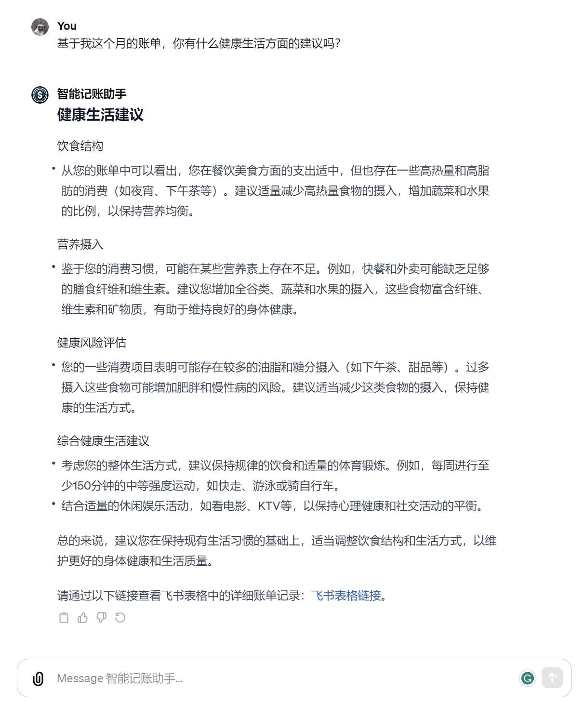

# 智能记账助手

> 一款专注于智能记账、深入财务分析以及提供生活建议的 GPTs ([体验地址](https://chat.openai.com/g/g-vG7XwEfNG-zhi-neng-ji-zhang-zhu-shou))

# 它能做些什么？

智能记账助手通过调用飞书 API，实现了数据的存储、查询、修改和删除等操作。

| 新增账单                                     | 修改账单                                 | 删除账单                                                     |
| -------------------------------------------- | ---------------------------------------- | ------------------------------------------------------------ |
| 用户：“我刚刚吃饭花了12元，请你帮我记录一下” | 用户：“我是使用微信支付的，请你帮我修改” | 用户：“请你帮我撤销最近的一笔账单，并告诉我这笔账单的具体明细。” |
|              |        |                            |

| 查询账单                                           | 财务分析                                             | 健康生活建议                                               |
| -------------------------------------------------- | ---------------------------------------------------- | ---------------------------------------------------------- |
| 用户：“我想知道到目前为止我最大的一笔支出是什么。” | 用户：“请针对我这个月的账单进行一次详细的财务分析。” | 用户：“基于我这个月的账单，你有什么健康生活方面的建议吗？” |
|                  |                    |                  |

<b>点击图片观看演示视频</b>

# 我该如何开始？

点击查看[部署教程](Deployment-Tutorial.md)

# 感谢

- [gpt-crawler](https://github.com/BuilderIO/gpt-crawler) Crawl a site to generate knowledge files to create your own custom GPT from a URL.
- [NotionNext](https://github.com/tangly1024/NotionNext) 一个使用 NextJS + Notion API 实现的，部署在 Vercel 上的静态博客系统。为Notion和所有创作者设计。
- [github-reader](https://github.com/sdaaron/github-reader) 启发了我。
# License

MIT License

